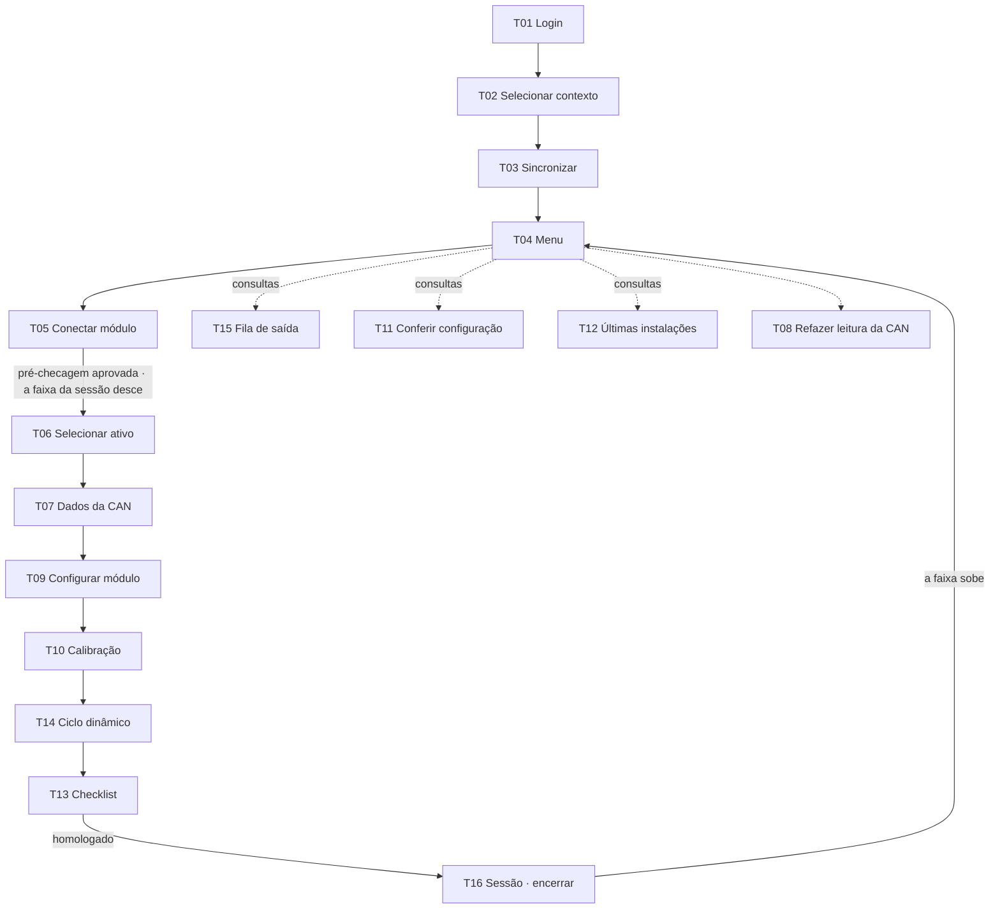

# Os fluxos

## O caminho feliz

**Em palavras:** entrar, dizer a unidade, baixar o pacote, conectar o módulo — é na pré-checagem aprovada que **a sessão nasce** e a faixa desce —, escolher e provar o ônibus, ler a CAN, gravar a cadeia, calibrar, andar com o ônibus, fechar o checklist e **encerrar a sessão**, provando que a configuração sobreviveu ao desligar. A fila, a conferência e as últimas instalações são **consultas**: abrem a qualquer hora pelo menu.

## Os desvios, por etapa

| Etapa | O desvio | Pra onde vai |
|---|---|---|
| entrar | usuário ou senha incorretos | fica no login, com o aviso |
| entrar | esqueci a senha | canal → código → nova senha → senha alterada → login |
| entrar | código errado · expirado · tentativas esgotadas | fica no código, com o motivo e o que fazer |
| contexto | pacote de 3 a 7 dias | avisa e deixa continuar |
| contexto | pacote de mais de 7 dias | bloqueia até sincronizar |
| conectar | uma checagem reprova | a linha que falhou fica vermelha, com a ação no aviso |
| conectar | firmware fora | atualiza — com rede no módulo, direto; sem, grava a conexão primeiro |
| ativo | chassi divergente | solicitar correção de cadastro |
| ativo | sem chassi na CAN | o técnico confirma o vínculo, e a confirmação entra na evidência |
| configurar | bloco recusado · queda | tenta de novo **do mesmo bloco** |
| configurar | tentar sair no meio | a recuperação segura até a Conexão gravar |
| ciclo | prazo do evento estourado | dispara outro — os passos continuam valendo |
| checklist | Seção F falhando | finaliza com a ciência do técnico, com nome e hora |
| encerrar | ENCERRAR antes de homologar | a sessão abortada: 4 passos, sem confirmação |
| encerrar | uma assertiva falha | a homologação bloqueia; o encerramento não |

Cada desvio tem a sua referência: `02-telas/<tela>/estados.md`.
