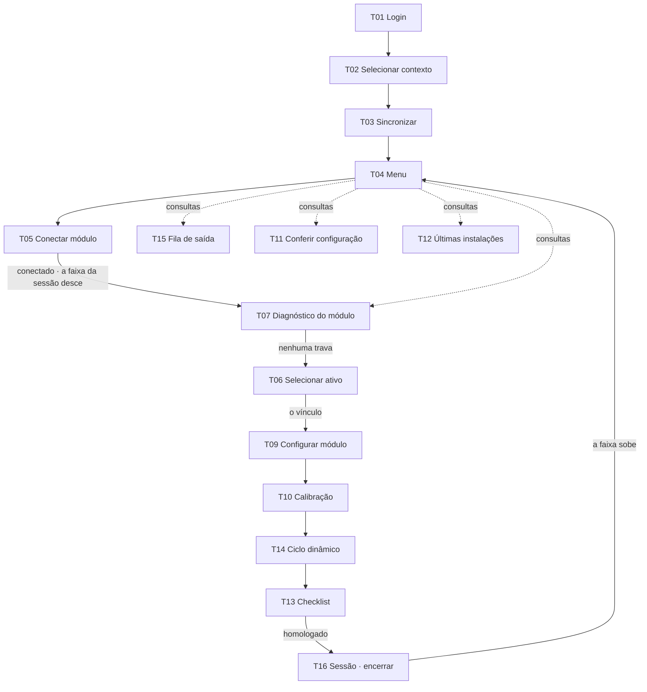

# Os fluxos

## O caminho feliz

**Em palavras:** entrar, dizer a empresa e a unidade, baixar o pacote, conectar o módulo — é na conexão que **a sessão nasce** e a faixa desce —, ver o diagnóstico do módulo, escolher o ônibus e confirmar o vínculo, conferir o que vai ser gravado, gravar a cadeia, calibrar, andar com o ônibus, fechar o checklist e **encerrar a sessão**, provando que a configuração sobreviveu ao desligar. A fila, a conferência e as últimas instalações são **consultas**: abrem a qualquer hora pelo menu.

## Os desvios, por etapa

| Etapa | O desvio | Pra onde vai |
|---|---|---|
| entrar | usuário ou senha incorretos | fica no login, com o aviso |
| entrar | esqueci a senha | canal → código → nova senha → senha alterada → login |
| entrar | código errado · expirado · tentativas esgotadas | fica no código, com o motivo e o que fazer |
| contexto | pacote de 3 a 7 dias | avisa e deixa continuar |
| contexto | pacote de mais de 7 dias | bloqueia até sincronizar |
| menu | sem rede | tudo continua de pé; só as últimas instalações esperam |
| diagnóstico | serial fora do cadastro · modelo sem suporte | a linha trava, com o motivo no aviso |
| diagnóstico | firmware não homologado | atualiza, se o módulo tem rede; sem rede, não dá |
| diagnóstico | modem sem sinal · uma leitura fora | só informa — o checklist registra |
| ativo | o módulo está em outro ativo | desvincula e vincula aqui · o desvínculo fica registrado |
| ativo | o módulo já é deste ativo | é manutenção: um bloco por vez |
| configurar | não cabe · cercas demais | a gravação não começa · procurar outro módulo |
| configurar | bloco recusado · queda | tenta de novo **do mesmo bloco** |
| configurar | tentar sair no meio | a recuperação segura até a Conexão gravar |
| ciclo | prazo do evento estourado | dispara outro — os passos continuam valendo |
| checklist | Seção F falhando | finaliza com a ciência do técnico, com nome e hora |
| encerrar | ENCERRAR antes de homologar | a sessão abortada: 4 passos, sem confirmação |
| encerrar | uma assertiva falha | a homologação bloqueia; o encerramento não |

No protótipo (decisão 36): o *sem confirmação* do ENCERRAR antes de homologar é de antes da decisão 36 — agora o diálogo *Encerrar sem homologar?* vem antes: `Continuar a instalação` fecha e deixa o técnico na tela; `Encerrar sem homologar` roda os 4 passos da sessão abortada. Depois de homologar, o ENCERRAR vai direto (`06-prototipo/logica.md` · ENCERRAR).

No protótipo (decisão 44): a sessão nasce na conexão, mas **a faixa desce na T07**, quando as sete linhas do módulo passam sem trava — é o que as referências desenham. Numa trava, o módulo fica em cima do título, sem faixa (`02-telas/T07-diagnostico-do-modulo/tela.md` · Chrome). Vale pro `conectado · a faixa da sessão desce` do diagrama e pro *a faixa desce* do *Em palavras*.

No protótipo (procurar outro módulo): na T07, `Procurar outro módulo` volta à busca da T05, com nada escolhido (`T05/01`) · na T09, a sessão já está aberta, e ele abre o diálogo *Encerrar sem homologar?*.

No protótipo (o painel do palco): a T07 fica só no caminho, depois da T05 · as consultas do painel são a T15, a T11 e a T12 (`06-prototipo/palco/referencias/html/04-painel-aberto.html`). A seta pontilhada do menu pra T07, no diagrama, é o cartão *Diagnóstico do módulo*.

Cada desvio tem a sua referência: `02-telas/<tela>/estados.md`.
