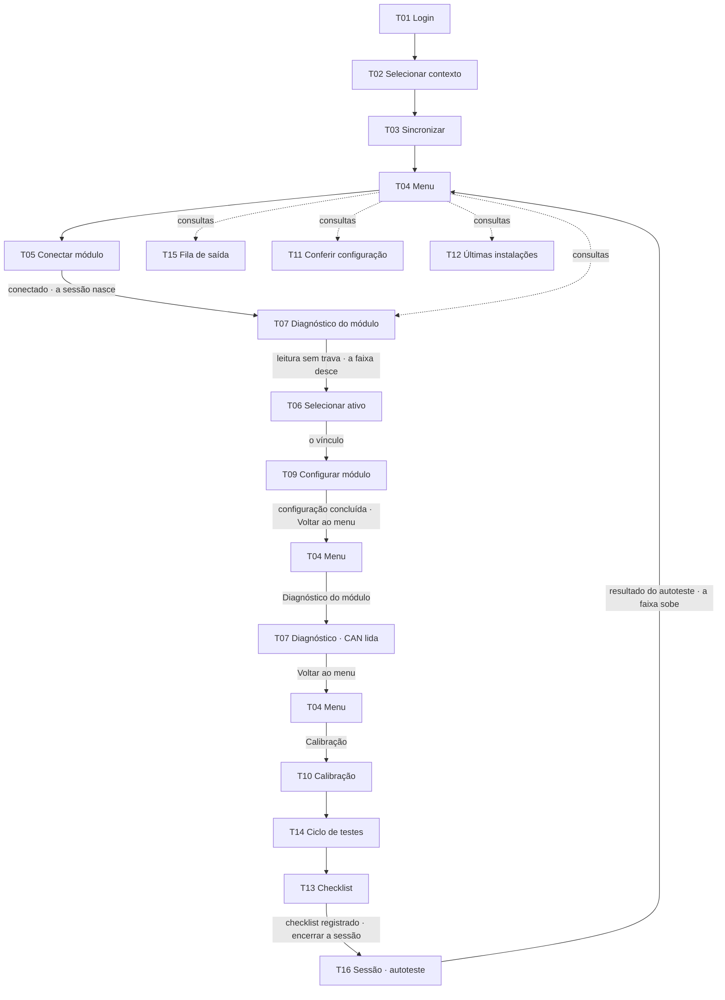

# Os fluxos

**Vigência: 08/10/2026.** Este mapa descreve o produto e o percurso normal do protótipo. Os cenários especiais expostos pelo palco são consultas paradas em *Estados desta tela*, com retorno ao fluxo anterior; não são atalhos para percursos de demonstração diferentes.

## O caminho feliz

**Em palavras:** entrar, escolher a empresa e a unidade, baixar o pacote, conectar o módulo — é na conexão que **a sessão nasce** —, ver o diagnóstico do módulo, escolher o ônibus e confirmar o vínculo, conferir o que vai ser gravado e gravar a cadeia. Concluída a T09, *Voltar ao menu*; pelo menu, abrir o diagnóstico novamente, agora com a CAN lida, e voltar ao menu para abrir a calibração. Dali, fazer o ciclo com o veículo parado, registrar o checklist e **encerrar a sessão**. A T16 reinicia o módulo automaticamente, relê e apresenta o autoteste: só depois desse resultado aparece a homologação. A fila, a conferência e as últimas instalações são **consultas**: abrem pelo menu quando disponíveis.

As repetições de T04 e T07 no diagrama mostram essas visitas às mesmas telas, sem criar telas novas. A T09 concluída não oferece um botão direto para a T10; a calibração é acessada pelo menu.

**No percurso do herói:** o técnico escolhe entre três empresas, e a Viação Atlântico Sul tem as unidades e os dados navegáveis desta demonstração. O M2C-0417 é vinculado ao RKT-8H42. Na T10, *Nada a calibrar neste ativo*: rotação e hodômetro vêm direto do veículo. O ciclo da T14 tem quatro passos — ignição ligada, rotação, cartão e ignição desligada — e o evento de teste. O cartão é comparado pelo técnico com o número impresso. O bip do leitor é respondido no checklist. Ré, porta, deslocamento e velocidade não são passos desse ciclo.

**Ao concluir a T14:** *Ir para o checklist* continua a instalação na T13; *Voltar ao menu* permite acessar outra ferramenta, preservando os resultados. Nenhum desses botões homologa nem encerra a sessão.

## Os desvios, por etapa

| Etapa | O desvio | Pra onde vai |
|---|---|---|
| entrar | usuário ou senha incorretos | fica no login, com o aviso |
| entrar | esqueci a senha | canal → código → nova senha → senha alterada → login |
| entrar | código errado · expirado · tentativas esgotadas | fica no código, com o motivo e o que fazer |
| contexto | pacote de 3 a 7 dias | avisa e deixa continuar |
| contexto | pacote de mais de 7 dias | bloqueia até sincronizar |
| menu | sem rede | tudo continua de pé; só as últimas instalações esperam |
| diagnóstico | serial fora do cadastro · modelo sem suporte | a linha trava, com o motivo no aviso |
| diagnóstico | firmware não homologado | com rede no módulo, atualiza e relê; sem rede, grava a conexão antes da atualização |
| diagnóstico | modem sem sinal · uma leitura fora | só informa — o checklist registra |
| ativo | o módulo está em outro ativo | desvincula e vincula aqui · o desvínculo fica registrado |
| ativo | o módulo já é deste ativo | é manutenção: um bloco por vez |
| configurar | não cabe · cercas demais | a gravação não começa · procurar outro módulo |
| configurar | bloco recusado · queda | tenta de novo **do mesmo bloco** |
| configurar | tentar sair no meio | a recuperação segura até a Conexão gravar |
| ciclo | prazo do evento estourado | dispara outro — os passos continuam valendo |
| checklist | Seção F falhando | finaliza com a ciência do técnico, com nome e hora |
| encerrar | ENCERRAR antes de registrar o checklist | confirma no diálogo; encerrando mesmo assim, a sessão abortada executa 4 passos |
| encerrar | uma assertiva falha | a homologação bloqueia; o encerramento não |

No protótipo (decisão 36 e retorno do PM de 06/10): antes de registrar o checklist, o diálogo *Encerrar antes de terminar?* vem antes: `Continuar a instalação` fecha e deixa o técnico na tela; `Encerrar mesmo assim` roda os 4 passos da sessão abortada. Com o checklist registrado e aguardando autoteste, o ENCERRAR leva diretamente ao encerramento completo da T16. Algumas notas históricas chamavam esse registro de *homologado*; a palavra agora fica só no resultado da T16 (`06-prototipo/logica.md` · ENCERRAR).

No protótipo (decisão 44): a sessão nasce na conexão, mas **a faixa desce na T07**, quando a leitura do módulo termina sem trava. O diagnóstico revisado em 06/10 tem nove linhas, oito contadas; mensagens pendentes só informam. Numa trava, o módulo fica em cima do título, sem faixa (`02-telas/T07-diagnostico-do-modulo/tela.md` · Chrome).

No protótipo (procurar outro módulo): na T07, `Procurar outro módulo` volta à busca da T05, com nada escolhido (`T05/01`) · na T09, a sessão já está aberta, e ele abre o diálogo *Encerrar antes de terminar?*.

No protótipo (o painel do palco): a T07 fica só no caminho, depois da T05 · as consultas do painel são a T15, a T11 e a T12 (`06-prototipo/palco/referencias/html/04-painel-aberto.html`). A seta pontilhada do menu pra T07, no diagrama, é o cartão *Diagnóstico do módulo*.

Cada condição tem a sua referência em `02-telas/<tela>/estados.md`. A existência da referência não torna o quadro um percurso interativo no palco: os exemplos de uma empresa só (T02), manutenção (T09), calibração do caminhão (T10), divergência (T11) e releitura de alimentação (T13) foram reunidos como consultas paradas. No painel e no endereço simples da tela, T02, T10 e T11 seguem o mesmo contexto do percurso normal. *Voltar ao fluxo* restaura o que estava aberto antes da consulta.
