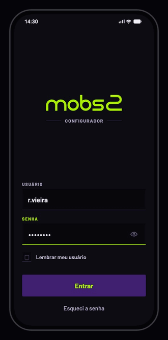

# Mobs2 Configurador

Aplicativo mobile de instalação, configuração e homologação de módulos de telemetria embarcados, usado pelo técnico de campo. Este repositório reúne o design do produto, o design system e o protótipo navegável construído a partir deles.

<p align="center">
  
</p>

<p align="center"><b><a href="https://configurador-mobs2-prototipo.vercel.app">Abrir o protótipo →</a></b></p>

## O problema

O técnico de campo é terceirizado e não conhece a lógica de programação do módulo. Ele instala em pátio, obra e zona rural, muitas vezes sem rede, às vezes embaixo do ônibus. E o equipamento não avisa quando algo dá errado: **sucesso de comando não é sucesso de configuração** — um bloco pode ser aceito e não funcionar, e um erro de faixa apaga em silêncio, aparecendo dias depois. O checklist antigo era uma lista de 30 itens marcáveis à mão, com um "marcar todos" que permitia homologar sem verificar.

A resposta do produto: **o sistema decide e o técnico executa**, todo envio é confirmado por releitura do módulo, e **a evidência é gerada pelo app, não digitada pelo técnico**.

## O que o app faz

O app conduz a instalação em sequência e prova cada passo:

1. **Sincroniza** o pacote da unidade — os ônibus, as conexões, os modelos, os eventos e as cercas — pra trabalhar mesmo sem rede.
2. **Conecta** ao módulo por Bluetooth ou cabo.
3. **Diagnostica** o módulo: serial, firmware, alimentação, GPS, entradas, modem e SIM. Serial fora do cadastro, modelo sem suporte ou firmware não homologado travam a instalação ali.
4. **Vincula** o módulo ao ônibus, confirmado pela placa, frota, fabricante e modelo.
5. **Grava a configuração** em seis blocos, cada um relido no módulo pra provar que chegou.
6. **Calibra** o hodômetro e, quando o modelo tem, o horímetro.
7. **Roda o ciclo de testes** com o ônibus parado: ignição, rotação, ré, porta e cartão do motorista.
8. **Fecha o checklist** de 31 itens — o app confere o que consegue sozinho e o técnico fotografa o resto — e encerra a sessão.

Nenhuma tela expõe comando, sintaxe ou parâmetro técnico: o técnico responde perguntas de negócio, e o app fala com o módulo.

## O protótipo

O protótipo roda no navegador e anda só por toque, do login ao encerramento. No computador, o celular aparece em tamanho real dentro de um palco:

- o quadrado no canto abre o painel com as 15 telas;
- a coluna ao lado lista os estados da tela aberta — sem rede, módulo que não responde, pacote vencido —, cada um montado pelo seu caso nos dados de exemplo;
- cada tela, momento e estado tem um link próprio (`?tela=T07&estado=02-estado-serial-nao-cadastrado`).

No celular, o app ocupa a tela inteira.

## Como foi construído

Cada tela, momento e estado tem uma referência desenhada, em HTML e PNG — 153 ao todo. O protótipo foi construído contra elas e comparado pixel a pixel; toda diferença que sobrou tem um nome e um motivo registrados. A comparação final, com cada referência ao lado do protótipo, está em [`06-prototipo/para-o-arquiteto/conferencia-final/`](06-prototipo/para-o-arquiteto/conferencia-final/).

O código não inventa nada: o comportamento vem da ficha de cada tela, os textos do `textos.md` dela, os valores dos tokens. Além das referências, o protótipo é verificado por 43 roteiros que tocam o app como o técnico — inclusive o caminho completo, com e sem horímetro — e por um gate que confere a coerência dos dados de exemplo.

| telas | momentos | estados | referências | histórias de usuário | casos de dados | decisões registradas |
|---|---|---|---|---|---|---|
| 15 | 73 | 65 | 153 | 109 | 56 | 54 |

## O repositório

```
01-produto/          por que existe, pra quem, as regras de negócio, as histórias e os fluxos
02-telas/            uma pasta por tela: ficha, estados, animação, textos e as referências
03-design-system/    tokens, leis, movimento, componentes e as oito folhas
04-dados/            os dados de exemplo (o contrato de dados) e o gate que confere
05-recursos/         a marca, a fonte, os ícones e os desenhos do sistema
06-prototipo/        o protótipo navegável, o palco e as ferramentas de verificação
07-decisoes/         o porquê de cada escolha, com o que foi descartado
08-para-o-dev/       por onde começar a construir o produto
```

A ordem de leitura de cada perfil está no [`LEIA-PRIMEIRO.md`](LEIA-PRIMEIRO.md), e o histórico de mudanças no [`CHANGELOG.md`](CHANGELOG.md). Quem vai desenvolver o produto começa por [`08-para-o-dev/`](08-para-o-dev/): o contrato de dados, as integrações com o módulo e o servidor, e os testes que já estão prontos.

## Rodar localmente

```bash
cd 06-prototipo/app
npm install
npm run dev
```

Abre em `http://localhost:5173`. As verificações ficam na mesma pasta: `npm run checar` e `npm run build`; com os fotógrafos rodando (`npm run fotografo` e `npm run fotografo:1`), `node scripts/tela.mjs todas` compara as 153 referências e `node scripts/caminho.mjs todos` roda os roteiros.
