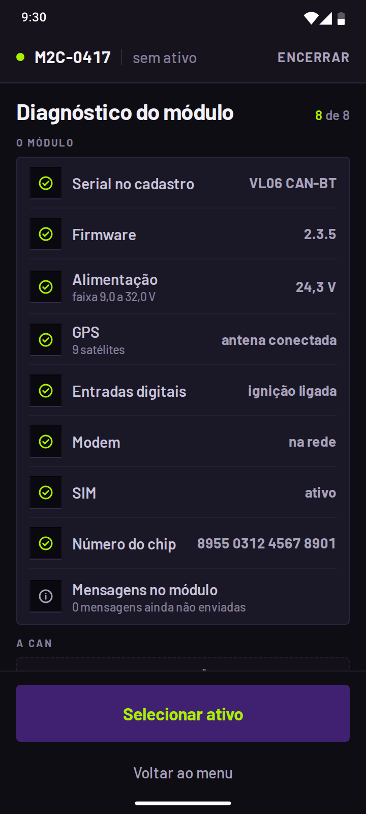
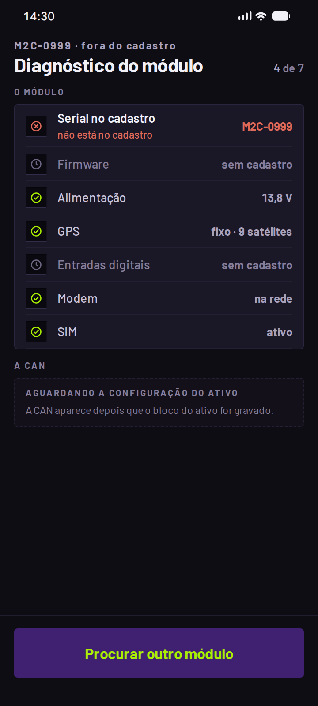
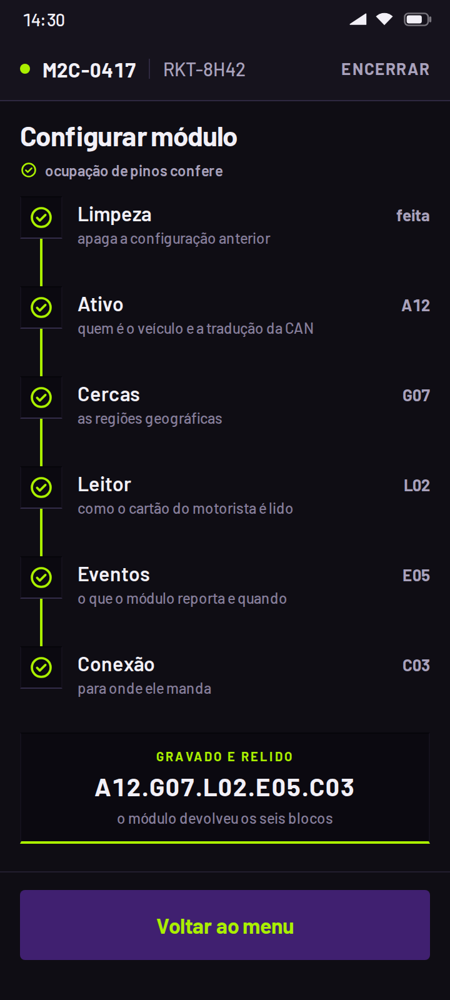
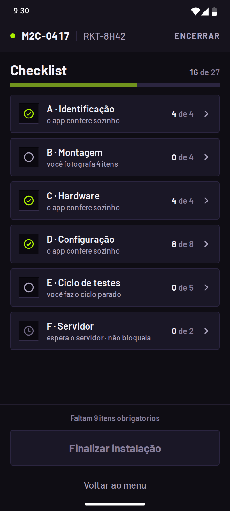
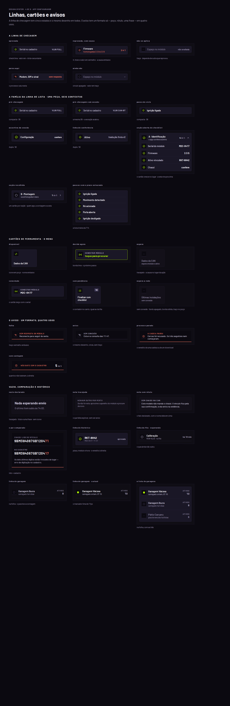

# Mobs2 Configurador

**O app que o técnico de campo usa pra instalar e homologar rastreadores em ônibus.** Design de produto, design system e protótipo navegável — do problema ao pixel, medido contra o gabarito.

<p align="center">
  
</p>

<p align="center"><b><a href="https://configurador-mobs2-prototipo.vercel.app">Abrir o protótipo do app →</a></b></p>

---

## O problema

O técnico instala o rastreador dentro do ônibus, **de luva, com pressa, às vezes no sol**, com o motorista esperando pra sair. Ele precisa conectar o módulo, gravar a configuração certa, calibrar, provar que tudo funciona e fechar um checklist de homologação — e qualquer erro vira um ônibus rodando com dado errado.

O princípio que guiou tudo: **a evidência é gerada pelo sistema, nunca digitada.** O técnico não escreve que o módulo funciona; o app lê, grava, relê e prova.

## As decisões que dão forma ao app

<table>
<tr>
<td width="25%"></td>
<td width="25%"></td>
<td width="25%"></td>
<td width="25%"></td>
</tr>
<tr>
<td><b>O diagnóstico antes de tudo.</b> Conectou, o app lê o módulo em sete linhas. O técnico vê na hora o que tem na mão.</td>
<td><b>Travas que impedem a instalação errada.</b> Serial fora do cadastro, modelo sem suporte, firmware não homologado: a tela para e diz o que fazer.</td>
<td><b>Gravar é conferir.</b> Cada bloco é gravado e relido no módulo. A prova é o que voltou, não o que foi mandado.</td>
<td><b>O checklist se preenche sozinho.</b> 31 itens: o app confere o que pode, o técnico fotografa o resto.</td>
</tr>
</table>

- **Desenhado pro polegar com luva.** Toque de 48, nada a menos de 8px do vizinho, linhas nas densidades do app (50 pra conferir, 44 pra lista longa).
- **Desenhado pro sol.** A tinta mínima tem contraste AA medido no fundo real; texto a partir de 12px.
- **O estado muda o conteúdo, nunca o desenho.** Uma falha não troca a tela de lugar: ela acende no elemento que falhou.
- **Lima só diz *passou*.** A cor de destaque marca veredito, escolhido e o primário — nunca enfeite.
- **Movimento que informa.** Só transform e opacity; nada anima a entrada de uma tela, e nada fica em loop.

## Como foi feito

O projeto andou em **três papéis**: um diretor que decide, um arquiteto que desenha e mede, e um executor que constrói — e cada ciclo começou com um **gate**: o censo do que existe, os achados, as decisões numeradas com o padrão adotado, e só depois a construção.

- **O design decide; o protótipo constrói.** O comportamento de cada tela mora na ficha dela, os textos exatos no `textos.md`, os valores no `tokens.css`, as leis no `leis.md`. O código não inventa número, texto nem cor.
- **Medido pixel a pixel.** As 142 referências (cada tela, momento e estado) têm HTML e PNG, e o protótipo é comparado com elas. Toda diferença que sobra tem um nome e um porquê.
- **Uma régua que anda pelo app.** 43 roteiros tocam o app como o técnico, pelo nome que o leitor de tela lê — o caminho inteiro, do login ao encerramento, com e sem horímetro.
- **Mesma entrada, mesma saída.** O relógio do produto está parado, e não há nada aleatório no código.

A conferência final — cada referência ao lado do protótipo — está em [`06-prototipo/para-o-arquiteto/conferencia-final/`](06-prototipo/para-o-arquiteto/conferencia-final/).

## O design system

<p align="center">
  
</p>

| tokens | peças | leis | folhas desenhadas |
|---|---|---|---|
| 295 | 106 | 23 | 8 |

Tudo em [`03-design-system/`](03-design-system/): os tokens (`tokens.css`, com o `tokens.json` gerado em formato neutro), as leis visuais e de produto, o movimento, as peças e as oito folhas.

## Em números

| telas | momentos | estados | referências | histórias de usuário | casos no mock | decisões registradas |
|---|---|---|---|---|---|---|
| 15 | 62 | 65 | 142 | 109 | 56 | 54 |

## O palco do protótipo

No computador, o celular aparece na moldura, em tamanho real quando a janela cabe, e anda só por toque. Em volta dele:

- **as telas:** o quadrado no canto abre o painel, e qualquer uma das 15 telas abre direto;
- **os estados:** a coluna ao lado lista os estados da tela aberta (sem rede, módulo que não responde, pacote vencido…), cada um montado pelo seu caso, e o `Voltar ao fluxo` devolve o instante de antes;
- **o endereço:** cada tela, momento e estado tem o seu link (`?tela=T07&estado=…`).

No celular, o app ocupa a tela inteira.

## Por dentro

```
01-produto/          por que existe, pra quem, as regras de negócio, as histórias e os fluxos
02-telas/            uma pasta por tela: ficha, estados, animação, textos e o gabarito visual
03-design-system/    tokens, leis, movimento, componentes e as oito folhas desenhadas
04-dados/            o mock (o contrato de dados) e o gate que prova que ele não mente
05-recursos/         a marca, a fonte, os ícones e os desenhos do sistema
06-prototipo/        o protótipo navegável, o palco, os ciclos e a régua
07-decisoes/         o porquê de cada escolha, com o que foi descartado
08-para-o-dev/       pro dev do produto: por onde começar, o contrato de dados, as integrações e os testes
```

A ordem de leitura de cada perfil está no [`LEIA-PRIMEIRO.md`](LEIA-PRIMEIRO.md), e o registro de tudo o que mudou, no [`CHANGELOG.md`](CHANGELOG.md). Quem vai construir o produto começa por [`08-para-o-dev/`](08-para-o-dev/).

### Rodar no computador

```bash
cd 06-prototipo/app
npm install
npm run dev
```

O protótipo abre em `http://localhost:5173`. A régua fica em `06-prototipo/app`: `npm run checar` e `npm run build`, e, com os fotógrafos no ar (`npm run fotografo` e `npm run fotografo:1`), `node scripts/tela.mjs todas` e `node scripts/caminho.mjs todos`. O cabeçalho de cada script explica o que ele mede.
